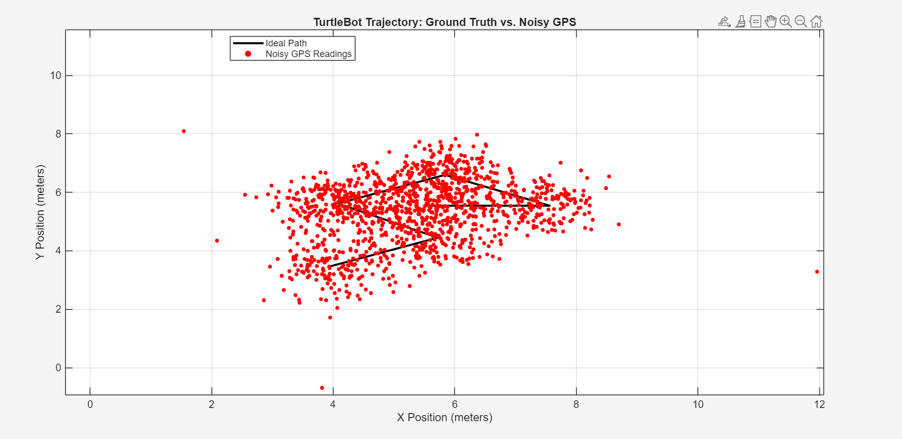
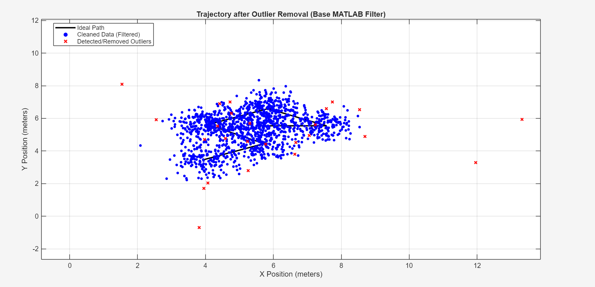
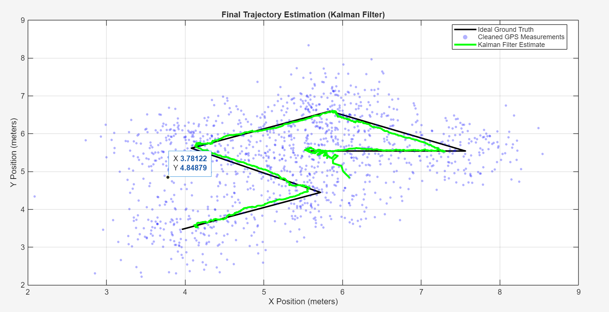

# Robotic Trajectory & GPS Anomaly Detection

## Overview
An end-to-end data generation and algorithmic filtering pipeline designed to simulate, detect, and correct severe sensor anomalies in robotic navigation systems. This project bridges a C++ ROS 2 simulation environment with a MATLAB statistical analysis backend.

## Architecture
1. **Data Generation (C++ / ROS 2):** A custom ROS 2 node subscribes to ideal `/turtle1/pose` kinematics, intentionally injecting mathematically modeled Gaussian jitter and severe outlier spikes (simulating catastrophic GPS/sensor failures), and logs the corrupted telemetry directly to a CSV.
2. **Outlier Analysis (MATLAB):** Imports the raw telemetry and applies a rolling median filter to statistically identify and eliminate sensor failures that fall outside acceptable standard deviations.
3. **State Estimation (MATLAB):** Implements a Kalman Filter from scratch. The Measurement Noise Covariance (R) and Process Noise Covariance (Q) matrices were manually tuned to optimize the state estimation, successfully recovering the robot's true trajectory from the heavily corrupted sensor data.

## Tech Stack
* **Simulation:** ROS 2 (Jazzy), C++, Turtlesim
* **Algorithm & Analysis:** MATLAB, Statistical Modeling, Matrix Manipulations

## How to Run

### Part 1: Generating the Telemetry Data (ROS 2)
1. Clone this repository into the `src` folder of your ROS 2 workspace.

2. Build the package and source your environment:
   ```bash
   cd ~/your_ros2_ws
   colcon build --packages-select gps_anomaly_sim
   source install/setup.bash
   ```

3. Launch the Turtlesim environment and the custom C++ noise injector:
    ```bash
    ros2 launch gps_anomaly_sim sim_launch.py
    ```

4. In a new terminal, launch the teleop node to drive the robot:
    ```bash
    ros2 run turtlesim turtle_teleop_key
    ```

5. Drive the robot around using your arrow keys to generate a complex trajectory. As you drive, the C++ node automatically logs the perfect and corrupted coordinates directly to `src/gps_anomaly_sim/matlab/turtle_trajectory.csv`.

6. Press Ctrl+C in the launch terminal to cleanly close the node and save the CSV file.

### Part 2: Analyzing the Data and State Estimation (MATLAB)
1. Open MATLAB and navigate your Current Folder to `src/gps_anomaly_sim/matlab/`.

2. Ensure the newly generated `turtle_trajectory.csv` is in this folder.

3. Run the `trajectory_analysis.m` script.

4. The script will automatically parse the telemetry and generate three plots: the raw noise comparison, the outlier detection/removal visualization, and the final Kalman Filter state estimation.

## Results
These are the graphs generated from the script

### Raw Noise Comparison

> The baseline trajectory of the TurtleBot (black) plotted against the raw, simulated GPS telemetry (red), which includes both Gaussian jitter and catastrophic sensor failures.
### Outlier Detection/Removal Visualization

> A rolling median filter successfully identifies and isolates the severe sensor anomalies (red X's) that fall outside acceptable standard deviations, leaving a cleaned baseline of measurements (blue).
### Final Kalman Filter State Estimation

> By tuning the Measurement and Process Noise Covariance matrices, the Kalman Filter (green) successfully ignores the remaining sensor jitter and accurately estimates the true physical trajectory of the robot.